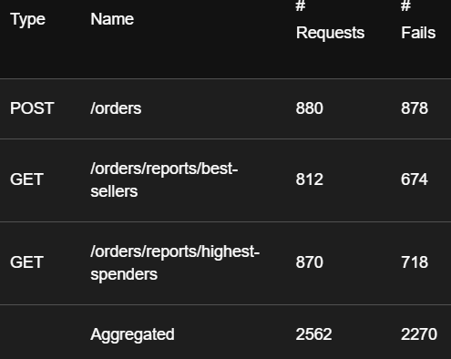

ÉTS - LOG430 - Architecture logicielle - Hiver 2026

Étudiant(e) : Laurent St-Hilaire

# Questions
(Il est obligatoire d'ajouter du code, des captures d'écran ou des sorties de terminal pour illustrer chacune de vos réponses.)

## 1.    Combien d'utilisateurs faut-il pour que le Store Manager commence à échouer dans votre environnement de test ? Pour répondre à cette question, comparez la ligne Failures et la ligne Users dans les graphiques.

Il faut 138 utilisateurs pour faire échouer le Store manager


## 2.  Sur l'onglet Statistics, comparez la différence entre les requêtes et les échecs pour tous les endpoints. Combien d'entre eux échouent plus de 50 % du temps ?

Tous les endpoints échouent plus de 50% du temps. 
La requête POST /orders échoue à 99% du temps (878/880)
La requête GET /orders/reports/best-sellers échoue à 83% du temps (674/812)
La requête GET /orders/reports/highest-spenders échoue à 82% (718/870)

## 3.   Affichez quelques exemples des messages d'erreur affichés dans l'onglet Failures. Ces messages indiquent une défaillance dans quelle(s) partie(s) du Store Manager ? Par exemple, est-ce que le problème vient du service Python / MySQL / Redis / autre ?

Les messages d'erreurs proviennent principalement du service MySQL dû au  fait qu'il y a trop de connexions au service (1040).

CatchResponseError('Erreur : 500 - (mysql.connector.errors.OperationalError) 1040 (08004): Too many connections\n(Background on this error at: https://sqlalche.me/e/20/e3q8)')

Lorsque MySQL ne répond plus, le service Python ne peut plus gérer les requêtes et envoie des erreurs 500 du système.

CatchResponseError('Erreur : 500 - Aucun JSON dans la réponse. Message : 500 Internal Server Error
Internal Server Error
The server encountered an internal error and was unable to complete your request. Either the server is overloaded or there is an error in the application.')


## 4.   Sur l'onglet Statistics, comparez les résultats actuels avec les résultats du test de charge précédent. Est-ce que vous voyez quelques différences dans les métriques pour l'endpoint POST /orders ?

    
## 5. Quels résultats avez-vous obtenus en utilisant l’endpoint POST /stocks/graphql-query avec les améliorations ? Veuillez joindre la sortie de votre requête dans Postman afin d’illustrer votre réponse.
La requête retoure les informations sur le produit ainsi que la quantité.

```
{
    "data": {
        "product": {
            "id": 1,
            "name": "Laptop ABC",
            "price": 1999.99,
            "quantity": 54,
            "sku": "LP12567"
        }
    },
    "errors": null
}
```
## 6.  Examinez attentivement le fichier docker-compose.yml du répertoire scripts, ainsi que celui situé à la racine du projet. Qu’ont-ils en commun ? Par quel mécanisme ces conteneurs peuvent-ils communiquer entre eux ? Veuillez joindre du code YML afin d’illustrer votre réponse.

Les deux fichier ont la partie réseau (network) en commun ce qui permet aux deux conteneurs de communiquer ensemble. Ils partagent le réseau bridge labo03-network.

networks:
  labo03-network:
    driver: bridge
    external: true