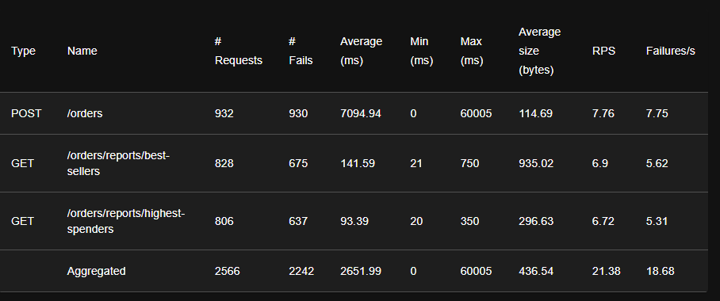
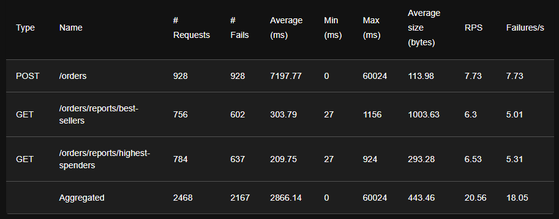

ÉTS - LOG430 - Architecture logicielle - Hiver 2026

Étudiant(e) : Laurent St-Hilaire

# Questions
(Il est obligatoire d'ajouter du code, des captures d'écran ou des sorties de terminal pour illustrer chacune de vos réponses.)

## 1.    Combien d'utilisateurs faut-il pour que le Store Manager commence à échouer dans votre environnement de test ? Pour répondre à cette question, comparez la ligne Failures et la ligne Users dans les graphiques.

Il faut 138 utilisateurs pour faire échouer le Store manager

## 2.  Sur l'onglet Statistics, comparez la différence entre les requêtes et les échecs pour tous les endpoints. Combien d'entre eux échouent plus de 50 % du temps ?

Tous les endpoints échouent plus de 50% du temps. 
La requête POST /orders échoue à 99% du temps (878/880)
La requête GET /orders/reports/best-sellers échoue à 83% du temps (674/812)
La requête GET /orders/reports/highest-spenders échoue à 82% (718/870)

## 3.   Affichez quelques exemples des messages d'erreur affichés dans l'onglet Failures. Ces messages indiquent une défaillance dans quelle(s) partie(s) du Store Manager ? Par exemple, est-ce que le problème vient du service Python / MySQL / Redis / autre ?

Les messages d'erreurs proviennent principalement du service MySQL dû au  fait qu'il y a trop de connexions au service (1040).

CatchResponseError('Erreur : 500 - (mysql.connector.errors.OperationalError) 1040 (08004): Too many connections\n(Background on this error at: https://sqlalche.me/e/20/e3q8)')

Lorsque MySQL ne répond plus, le service Python ne peut plus gérer les requêtes et envoie des erreurs 500 du système.

CatchResponseError('Erreur : 500 - Aucun JSON dans la réponse. Message : 500 Internal Server Error
Internal Server Error
The server encountered an internal error and was unable to complete your request. Either the server is overloaded or there is an error in the application.')

## 4.   Sur l'onglet Statistics, comparez les résultats actuels avec les résultats du test de charge précédent. Est-ce que vous voyez quelques différences dans les métriques pour l'endpoint POST /orders ?

Les métriques pour les résultats actuels et les résultats du test de charge précédent sont très similaires puisque le nombre de connexions maximum de MySQL est atteint indépendamment de l'amélioration de /orders. Le POST /orders prend plus de temps à exécuter, ce qui permet aux autres requêtes GET de saturer le système avant qu'il y ait une amélioration pour l'ajout de commandes.

Activité 5
 

Activité 6

    
## 5. Si nous avions plus d'articles dans notre base de données (par exemple, 1 million), ou simplement plus d'articles par commande en moyenne, le temps de réponse de l'endpoint POST /orders augmenterait-il, diminuerait-il ou resterait-il identique ?

Le temps de réponse augmenterait puisque la base de donnée doit filtrer plus de produits et retourner la liste qui contient plus d'item. Par rapport au code initial, le nombre de requêtes est grandement réduit mais la taille de la requête SQL risque d'être plus lourde à traiter.

## 6.   Sur l'onglet Statistics, comparez les résultats actuels avec les résultats du test de charge précédent. Est-ce que vous voyez quelques différences significatives dans les métriques pour les endpoints POST /orders, GET /orders/reports/highest-spenders et GET /orders/reports/best-sellers ? Dans quelle mesure la performance s'est-elle améliorée ou détériorée (par exemple, en pourcentage) ?

## 7. La génération de rapports repose désormais entièrement sur des requêtes adressées à Redis, ce qui réduit la charge pesant sur MySQL. Cependant, le point de terminaison POST /orders reste à la traîne par rapport aux autres en termes de performances dans notre scénario de test. Alors, qu'est-ce qui limite les performances de l'endpoint POST /orders ?

## 8. Sur l'onglet Statistics, comparez les résultats actuels avec les résultats du test de charge précédent. Est-ce que vous voyez quelques différences significatives dans les métriques pour les endpoints POST /orders, GET /orders/reports/highest-spenders et GET /orders/reports/best-sellers ? Dans quelle mesure la performance s'est-elle améliorée ou détériorée (par exemple, en pourcentage) ? La réponse dépendra de votre environnement d'exécution (par exemple, vous obtiendrez de meilleures performances en exécutant 2 instances de Store Manager sur 2 machines virtuelles plutôt que sur une seule).

## 9. Dans le fichier nginx.conf, il existe un attribut qui configure l'équilibrage de charge. Quelle politique d'équilibrage de charge utilisons-nous actuellement ? Consultez la documentation officielle de Nginx si vous avez des questions.